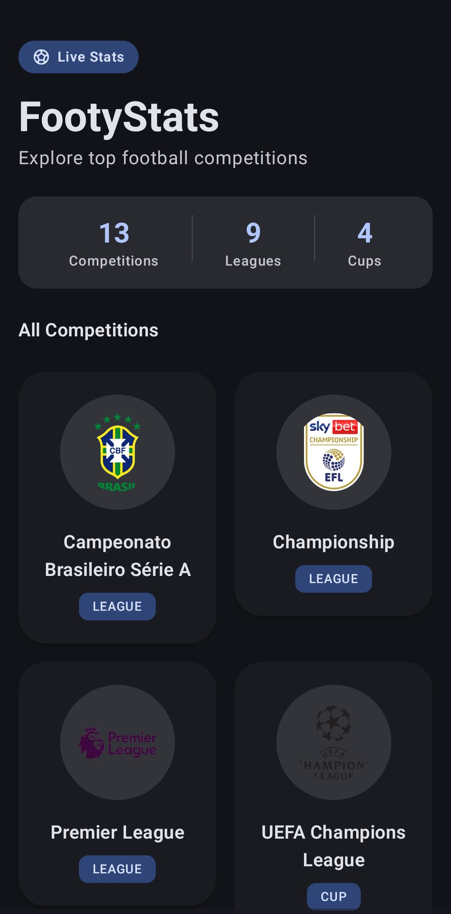
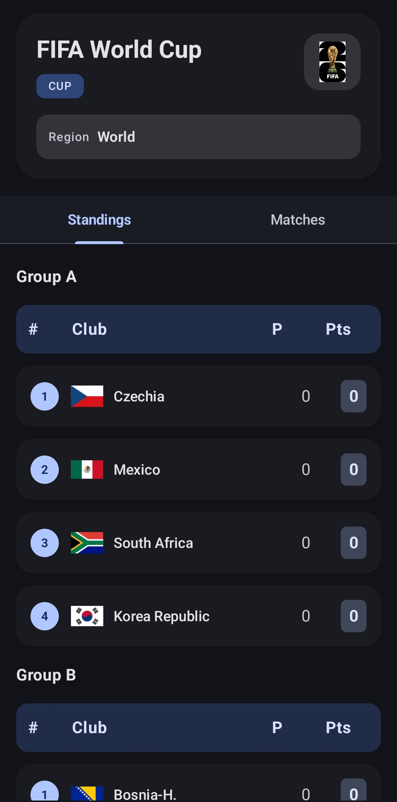

# ⚽ FootyStats
Explore football competitions, standings, and league information from around the world.
A modern Android application built with **Kotlin** and **Jetpack Compose** that allows football fans to explore competitions, league standings, and football data from around the world.

Powered by the **Football-Data API**.

🚀 Fast • 📱 Modern UI • ⚽ Real-time Football Data

---

## 📸 Screenshots

<p align="center">
  
  
</p>

---

## ✨ Features

- 🏆 Browse football competitions worldwide
- 📊 View league standings and rankings
- ⚽ Explore competition details
- 🔄 Real-time football data from Football-Data API
- 🎨 Modern Material 3 UI
- 📱 Built entirely with Jetpack Compose
- 🏗️ MVVM Architecture

---

## 🛠️ Tech Stack

- Kotlin
- Jetpack Compose
- MVVM Architecture
- Retrofit
- OkHttp
- Coil
- Navigation Compose
- Kotlin Coroutines
- Material 3

---

## 🚀 Getting Started

### Clone the Repository

```bash
git clone https://github.com/Rasesh-7/FootyStats.git
cd FootyStats
```

### Get an API Key

This application uses the Football-Data API.

1. Visit https://www.football-data.org/
2. Create a free account.
3. Generate your API key.

### Configure the API Key

Create a file named `gradle.properties` in the project root and add:

```properties
FOOTBALL_API_KEY=YOUR_API_KEY_HERE
```

### Run the App

1. Open the project in Android Studio.
2. Sync Gradle files.
3. Run the application on an emulator or Android device.

---

## 📂 Project Structure

```text
app
├── data
│   ├── model
│   ├── remote
│   └── repository
├── viewmodel
├── appui
│   ├── components
│   └── screens
└── ui
    └── theme
```

---

## 🔒 Security

API keys are intentionally excluded from this repository.

To run the project, generate your own Football-Data API key and configure it locally through `gradle.properties`.

Never commit your API key to GitHub.

---

## 📈 Future Improvements

- 📅 Match schedules
- 🔴 Live scores
- 📊 Team statistics
- 👤 Player information
- ⭐ Favorites and bookmarks
- 🌙 Enhanced dark mode support

---

## 🤝 Contributing

Contributions, feature requests, and suggestions are welcome.

1. Fork the repository
2. Create a feature branch
3. Commit your changes
4. Open a Pull Request

---

## 👨‍💻 Developer

**Rasesh Bose**

B.Tech CSE (AI & ML) @ KIIT University

Passionate about Android Development, AI/ML, and building impactful software solutions.

---

## ⭐ Support

If you found this project useful, consider giving it a **Star ⭐**.

It helps others discover the project and motivates future development.